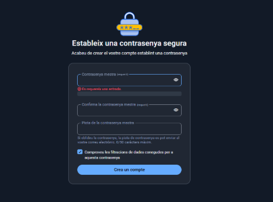
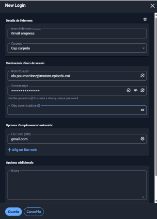

# **Fase 2: Guia d'Ús Tècnica (Manual Operatiu)**

## 1. Instal·lació i Configuració Inicial: Descàrrega, instal·lació i creació de la BBDD principal o compte mestre.

En primer lloc, per instalar la aplicación de Bitwarden, entra a la microsoft store i cerca “Bitwarden” també es pot instalar per la pagina offical de Bitwarden “[Bitwarden](https://bitwarden.com/download)” 

Un cop dintre de l’aplicació de Bitwarden ves a l'apartat de “Crear un compte”.

Posa la teva adreça electrònica i el teu nom per crear una compte.

Estableix una contrasenya per crear el compte, (mínim 12 Caràcters amb majúscules, minúscules, números i símbols)

Un cop establert la contrasenya prem “Crear un compte”

## 2. Generació de Contrasenyes Segures: Explicació de com utilitzar el generador de contrasenyes de l'eina (paràmetres, longitud, caràcters especials

Per utilitzar el generador de contrasenyes, ves al apartat de “Eines \- Generados”, dintre del apartat del generador, pots seleccionar els paràmetres desitjats

- Longitud  
- Majúscules i minúscules  
- Números  
- Caràcters especials

Fes clic a **“**Genera**”** i copia la contrasenya.

## 3. Exemples d'Ús i Emplenament Automàtic:

**Com desar una credencial d'un compte de correu electrònic.**

Dintre del menú principal, fes clic a “ \+ Element nou”.

Un cop dintre, configura un compte de correu electrònic.  
Exemple:

Com desar una credencial d'una aplicació o servei web.

En primer lloc, has de instalar la extensió de google de Bitwarden desde el “Chrome web store”.

Un cop instalada la extensión de Bitwarden, clica iniciar sessió i utilitza el correu i contrasenya que has seleccionat anteriorment.

Quant ja hagis iniciat sessió en la extenció, entra en qualsevol pagina web o aplicació en el meu cas he escollit el github. 

Un cop iniciat sessió en la página web, et sortirà una alerta a la part superior dreta per guardar la contrasenya en l'extensió de BitWarden.

Com fer servir l’extensió del navegador per emplenar automàticament les dades.

En primer lloc entra al lloc web que vulguis iniciar sessió.

si ja tens les credencials confgiurades, t’hauria de sortir les credencials.

Si no tens les credencials configurades, clica a inci de sessió nou”

Despres et sortira aquesta pestaña per configurar les credencials, introdueix el correu i la contrasenya per tenir les credencials configurades.

Exemple: 

i ja estaria les credencials del github configurades.

## 4. Gestió de Còpies de Seguretat (Backup):  
   

Explicació detallada de com fer una còpia de seguretat de l'arxiu de contrasenyes (KDBX en KeePass o Exportació en Bitwarden).

Per fer una copia de seguretat en Bitwarden, ves a l’apartat de “Eines \- Exporta la caixa forta”

Hi han diferents tipus per exportar, el “**Json**” es el mes recomanat per què es el mes fácil de llegir, i el “**Csv**” es un format més compatible amb altres gestors de contrasenyes.  

Abans de exportar, introdueix la contrasenya de mestra.

i ja estaria descarregat.

Recomanació de la millor pràctica per emmagatzemar aquesta còpia de seguretat de forma segura (clau USB xifrada o emmagatzematge xifrat al núvol).

Perquè un arxiu .json sigui segur, guarda’l en un directori protegit i fora de l’accés públic, per exemple:

- A l’ordinador local, dins d’una carpeta amb permisos restringits (només el teu usuari pot llegir/escriure).  
- Fora de carpetes públiques o del servidor web.  
- En un emmagatzematge segur al núvol que ofereixi xifrat i control d’accés (com AWS S3 amb permisos privats o Google Drive amb accés limitat).

Ves al [Informe](informe.md)

Torna a [L'enunciat](README.md)

Torna a la pàgina [principal](../README.md)

