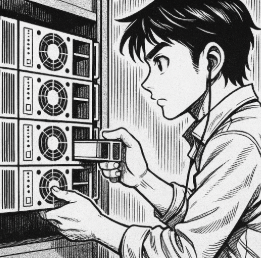

# T03: Gestió flexible de discos Disseny i Documentació de Solucions d’Emmagatzematge per a “Garriga i Associats”

## Context

Un cop superada la fase de formació, ja esteu preparats per afrontar el repte dels nostres clients.  

Com ja es va explicar, tenim un nou i important client: **el bufet d’advocats Garriga i Associats**, un dels més prestigiosos de la ciutat, ha requerit els serveis de la nostra consultora.  

Gestiona una gran quantitat d'informació legal **altament sensible**, per la qual cosa la **integritat**, la **disponibilitat** (alta redundància) i la **facilitat de gestió** del seu emmagatzematge són d'importància crítica.

---

## Necessitats del Client

La direcció de *Garriga i Associats* ha expressat la necessitat urgent de **renovar els seus sistemes de servidors** per garantir que:

- La informació estigui protegida contra **fallades de disc**.  
- L’espai d’emmagatzematge **pugui ser ampliat sense interrupcions**.

---

## Objectiu del Projecte

Com a tècnics d’**EverPia**, teniu l'encàrrec de **dissenyar i documentar les solucions d'emmagatzematge** que compleixin aquests requisits tant en **entorns Linux com Windows**.  

Aquest disseny permetrà presentar al client una **proposta de solució tècnica**.

L'objectiu principal és **dissenyar i documentar dues solucions d'emmagatzematge** (una per a servidors Linux i una per a servidors Windows) que compleixin amb els principis d’**alta disponibilitat, redundància i escalabilitat** per al client.  

>  Com que es tracta d’una *prova de concepte*, no treballareu amb servidors reals, sinó que, per facilitat, usareu **màquines virtuals de sistemes operatius clients** per documentar els procediments.

##  Part Linux: LVM amb Zorin OS

S'ha d'utilitzar la distribució **Zorin OS** (o una alternativa Linux compatible) per demostrar la utilitat del **Logical Volume Manager (LVM)**.

### Requisits de la Implementació i Demostració

####  Configuració Inicial
- Crear un **grup de volums (VG)** i un **volum lògic (LV)** utilitzant inicialment un mínim de **dos discs durs (simulats) de 10 GB**.  
- Aquest volum haurà d’estar **formatat i muntat automàticament** al sistema mitjançant l’edició de l’arxiu `/etc/fstab`.

####  Alta Disponibilitat
- Implementar la configuració d’un **mirall (lvm_mirror)** que protegeixi la informació davant la fallada d'un disc.

#### 🕒 Instantànies (*snapshots*)
1. Crear i afegir **dos discos de 10 GB** al grup de volums.  
2. Crear un volum **`lvm_dades`** amb el primer disc afegit, formatar-lo i muntar-lo.  
3. Afegir arxius al volum (poden ser imatges d’Internet).  
4. Usar el segon disc per crear un **snapshot (`lv_snapshot`)** i documentar **com es pot restaurar** aquest snapshot si la informació original es danya.

####  Escalabilitat
- Demostrar el procés d’**ampliació** del volum.  
- Usar l’espai que quedi lliure dins el grup de volums per **ampliar el volum `lv_dades`**.

---

## 2️ Part Windows: Espais d'Emmagatzematge (*Storage Spaces*)

S'ha d'utilitzar **Windows 11** per demostrar les configuracions possibles mitjançant els **Espais d'Emmagatzematge (Storage Spaces)**.

### Requisits de la Implementació i Demostració

#### 🔧 Configuració Inicial
- Crear un **Storage Pool** inicialment amb **tres discos de 10 GB (simulats)**.

####  Estudi de Configuracions

1. **Resiliència de Mirall (Mirroring):**  
   - Usar **dos discos**.  
   - Comprovar que ofereix **alta disponibilitat**.

2. **Resiliència de Paritat (Parity):**  
   - Explicar la seva **eficiència d'espai** en comparació amb el mirall.  
   - Cal usar **els tres discos**.

3. **Resiliència de Mirall Triple:**  
   - Afegir **tants discos de 10 GB com siguin necessaris** per demostrar aquesta configuració.

####  Demostració de la Gestió
- Mostrar com es visualitza **l'estat dels discos i del pool** des de la consola de gestió de Windows.  
- Simular la **facilitat de manteniment** per part dels administradors.

---

##  Organització del Treball

El treball serà **en grup**.

1. En primer lloc, **us dividireu en dos equips**:
   - Equip 1 → Gestió en equips **Linux** mitjançant **LVM**.  
   - Equip 2 → Gestió en equips **Windows** mitjançant **Storage Spaces**.

2. Un cop dividits, **individualment preparareu el guió** de la tasca a realitzar:
   - Cercar comandes.  
   - Consultar documentació i enllaços de referència.  

3. Cada parella **realitzarà la seva part de la demostració**.  
4. Finalment, **tot el grup revisarà la documentació** generada i cada membre **la pujarà al seu repositori personal**.

---

##  Lliurament

- La documentació dels dos casos es farà en **format Markdown**, incloent:
  - Imatges  
  - Explicacions  
  - Procediments  

- Tot el material s’ha de desar dins una carpeta anomenada **`tasca03`** dins del projecte.

- L’arxiu **`README.md`** d’aquesta carpeta ha de contenir:
  - La **descripció de la tasca**.  
  - Els **enllaços** per accedir als dos documents (Linux i Windows).

---

##  Avaluació i Presentació

- La **nota de la tasca és conjunta** al grup.  
  > Organitzeu-vos bé i mantingueu una bona comunicació interna.  

- Posteriorment, haureu de **presentar al client les conclusions** de la vostra feina en una **presentació conjunta**.

---

 *L’èxit d’aquest projecte dependrà de la vostra capacitat per combinar coneixement tècnic, treball en equip i una documentació clara i precisa.*

[Torna a la pàgina principal](../README.md)
