# **T04: Serveis de directori. LDAP**

## **3.1. Instal·lació i Configuració Base d'OpenLDAP**

Un cop dins de la màquina, canvia el nom del server.

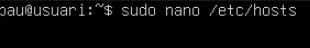

Entra en la configuració del domini per canviar el nom.

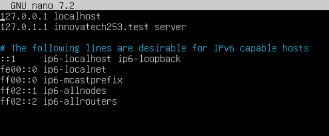

Canvia el nom com surt en pantalla, “server.innovatech253.test”

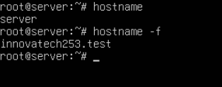

Comprovem que el nom del domini ha canviat utilitzant “**hostname \-f**”

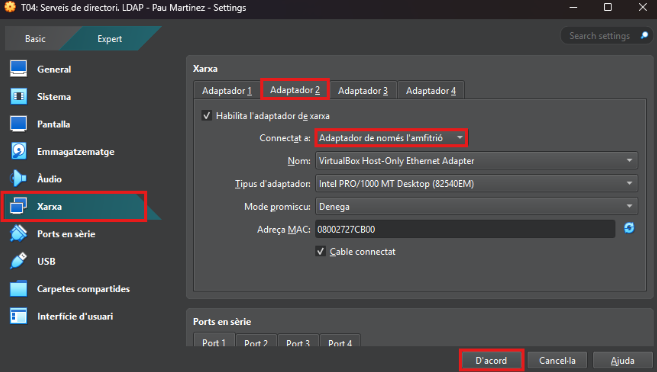

afegeix una segona interfície privada “Host-Only”

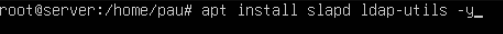

Per instal·lar el OpenLDAP utilitza aquest codi.

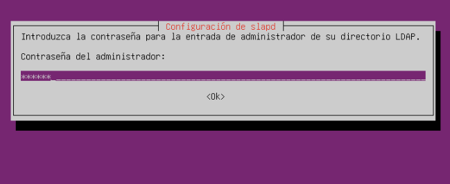

Introdueix la contrasenya d'administrador, en el meu cas usuari

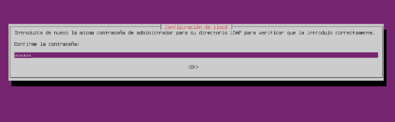

Introdueix un altre cop la contrasenya d'administrador.

Per veure l'estat del slapd utilitza el codi mostrat en la captura

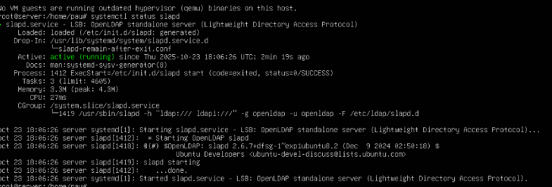

Per comprovar que el directori s’ha creat amb el nom que volem, utilitza “**Sudo slapcat**” i ens sortirà el nom del directori **“innovatech18.test”**

**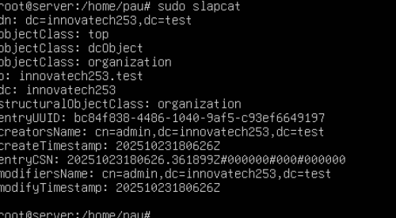**

****                

**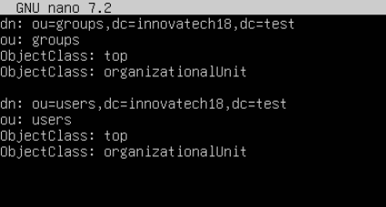**

## **3.2. Gestió i Administració (LAM)**

**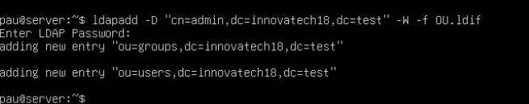**

Instal·larem directament el paquet del gestor

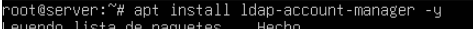

Utilitza la “**Ip a**” per mirar la IP de la enp0s8.

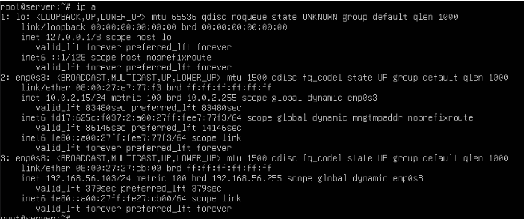

Ara posa la ip \+ **“/lam/templates/login.php”** per entrar dintre.

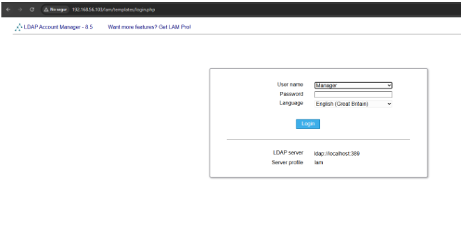
Clica a **“LAM configuration”**.

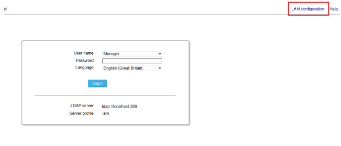

Ara clica a **“Edit server profiles”**

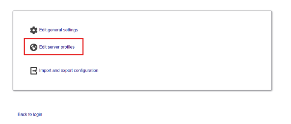

Si vols canviar el password o crear un nou perfil, ves a **“Manage server profiles”** 

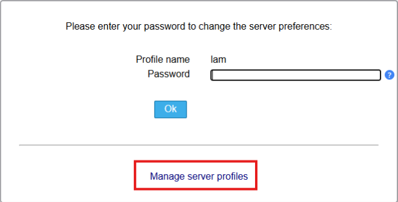

La contrasenya és la mateixa que el nom del perfil **“lam”**

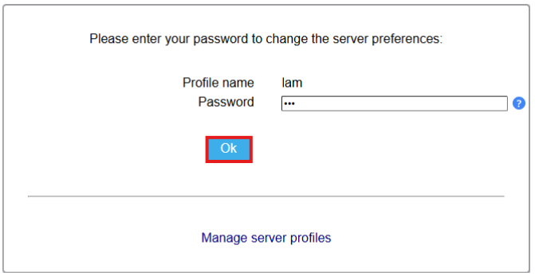
Canvia la configuració del server com surt a la pantalla.

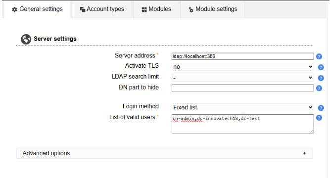

També canvia la de **“Tool”**  
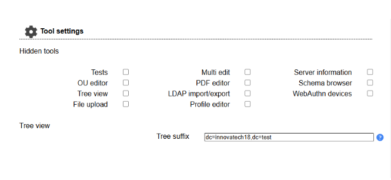

Canvia la configuració del **“users”** i dels **“grups”** com a la captura de la pantalla.

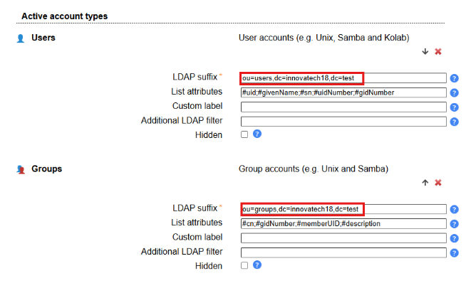

Contrasenya **“usuari”**

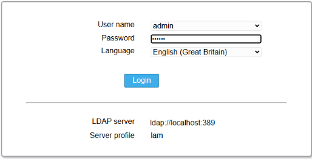

Entra a **“groups”.**

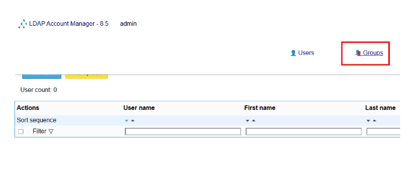

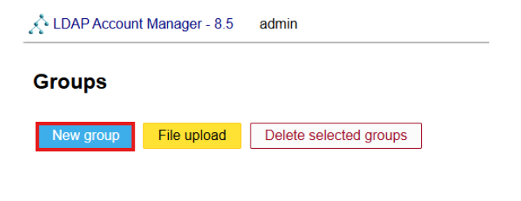
Crea un nou grup.

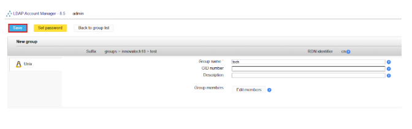
Posa de nom al grup **“Manager”**

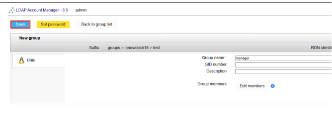
Crea un nou usuari.

Posal·li de last name **Tech01** i entra a **“Unix”**

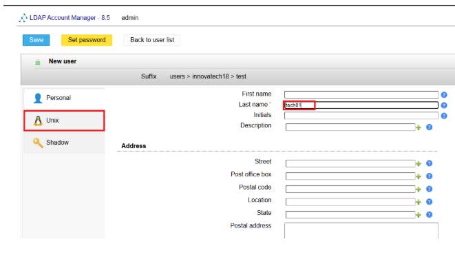  
Posal·li de nom **“Tech01**” i a UID number posa 10000

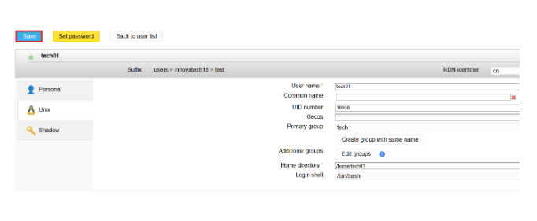

Crea un altre user amb el last name de **“manager01”**

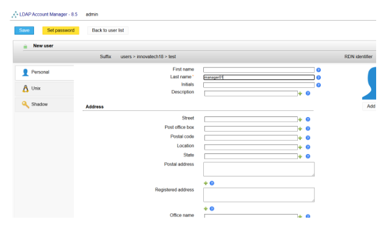  
Entra a **“unix”**, posa de nom **“manager01”** i a UID número posa **10001**

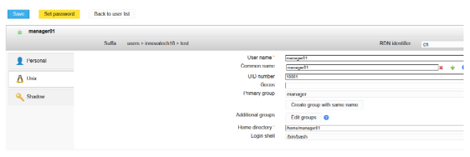  
Afageix·li una contrasenya a l’usuari **“manager01”** 

## **4\. Integració de Client (Client Ubuntu Desktop)**

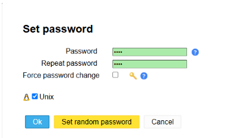

Entra amb una màquina de Zorin i posa de segona interfície host only.

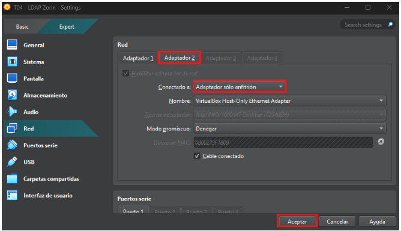

Entra a la carpeta de **/etc/hosts** per canviar el nom del domini.

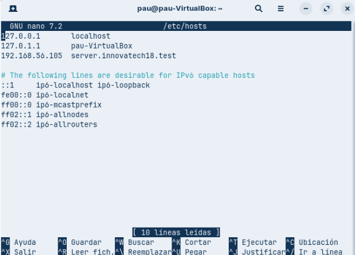

Canvia el nom del domini.

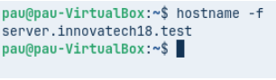

Comprova que el nom del domini és correcte.  
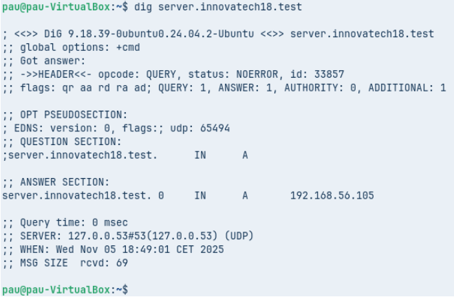

Utilitza la comanda **“dig”** per comprovar que els noms funcionen correctament.

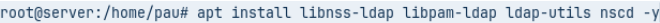

Instal·la **“lDAP”**

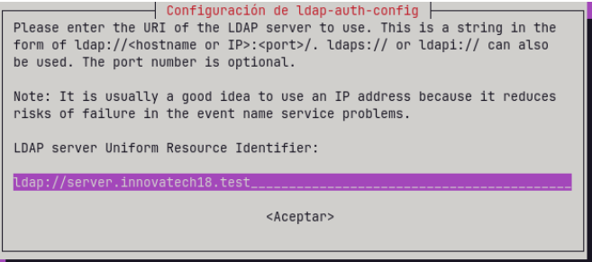

Canvia el nom perquè sigui el mateix que el domini i també borra una línia si no, no funcionarà la instal·lació

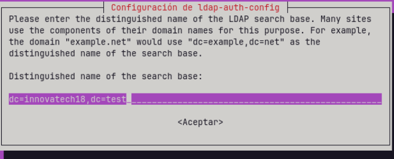

Canvia com surt a la captura de pantalla

Prem **“3”**

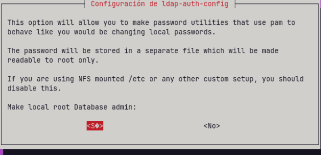

Prem **“Si”** perquè l’usuari root pugui canviar les contrasenyes del LDAP

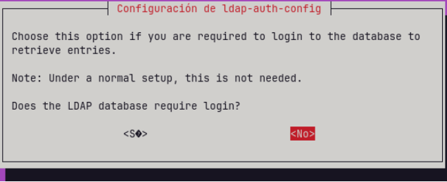

Prem **“no”**

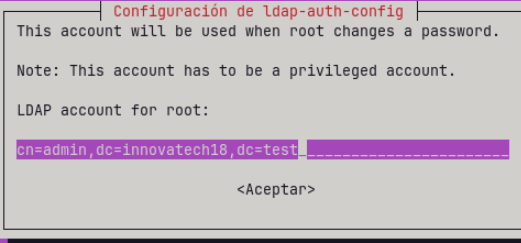

Canvia com surt a la captura

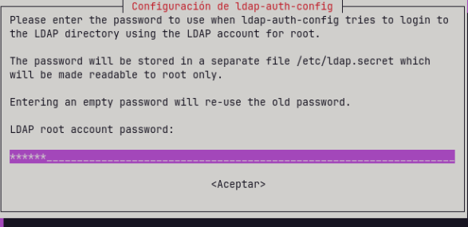

Utilitza la teva contrasenya en el meu cas **“usuari”.**

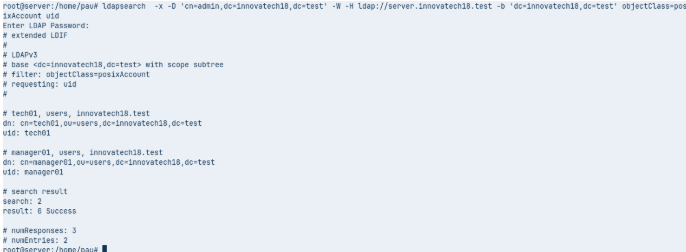

Copia aquest comanda per comprovar sí el client conecta amb el servidor.  

 Configurem l'arxiu **nsswitch.conf** per indicar que s'usarà LDAP per usuaris i grups.

Canvia la configuració com surt a la imatge.

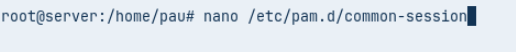

Utilitza aquesta comanda per entrar a l'arxiu **“/etc/pam.d/common-password**”.  
elimina  la línia el terme **“use authtok.”**

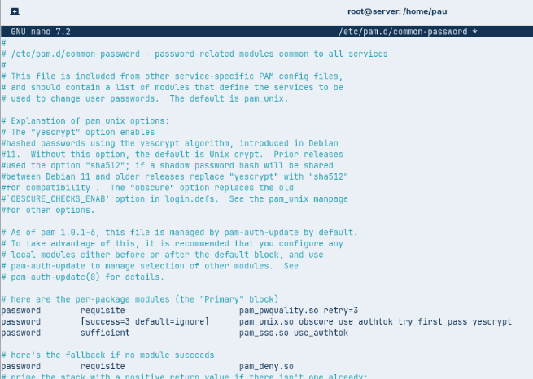

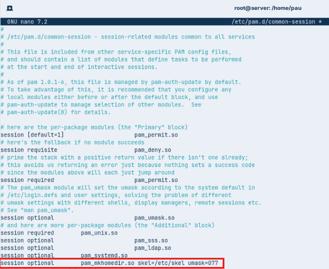

Ara edita l'arxiu **/etc/pam.d/common-session** i afegeix la línia marcada en vermell  per crear els perfils.

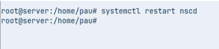

Utilitza aquesta comanda per reiniciar el servei **nscd.**

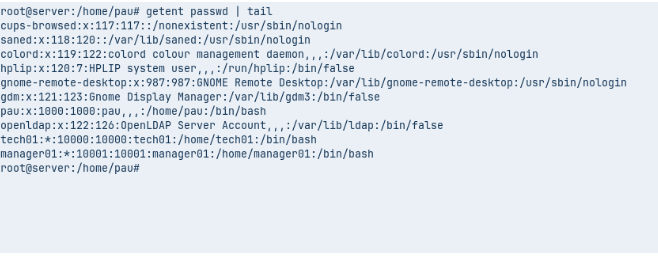

Comprova que els usuaris es veuen al LDAP  
 

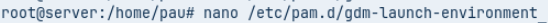

ara edita l'arxiu indicat, per permetre l'inici de sessió

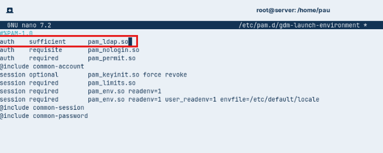

Copia el mostrat a la captura de pantalla.  

Reincia la màquina virtual i inicia sessió amb l’altre usuari.

Posa **“manager01”**

Introdueix la contrasenya que has introduït anteriorment al **“LAM”**

Un cop dins de la màquina virtual amb l’altre usuari, entra a la terminal

Un cop iniciem sessió, comprovem com se li ha creat la carpeta personal i comprovem l'usuari amb la comanda **“id”**
