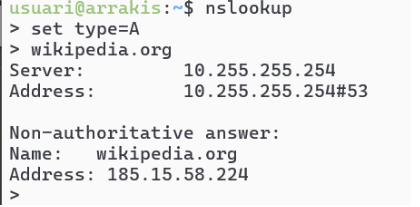

# **T06: Fonaments del servei DNS**

Com membres cada cop més integrats de l'equip tècnic de la consultora EverPia, teniu davant un nou repte. El vostre client, una empresa de màrqueting digital (**DigiCore**), que experimenta de tant en tant errors de connectivitat a certes aplicacions. El seu equip tècnic creu que la causa principal podria ser una resolució de noms (DNS) incorrecta o lenta.

Se us ha encarregat realitzar una auditoria teòrica i pràctica del servei DNS per tal de formar el personal del client i oferir eines de diagnosi ràpides.

**Fase teòrica: Sessió formativa**

Com a part d’aquesta formació, caldrà que elaboreu un material formatiu pel personal del client. Per assegurar la màxima qualitat en els continguts, els vostres directors tècnics han preparat unes sessions prèvies, per tal que tingueu un domini dels conceptes que després haureu d’explicar.

Aproximadament el conceptes que haureu d’explicar seran els següents:

* **Jerarquia i Estructura**: Explicació de l'estructura en arbre del DNS (Root \> TLDs \> Segon Nivell).  
* **Procés de Resolució**: Com es realitza una consulta iterativa i una recursiva. Què és un servidor d'arrel (Root Server) i un servidor autoritatiu.  
* **Tipus de zones:** Directa i inversa. Zona primària i zona secundària.  
* **Tipus de Registres Clau** (Records): Descripció de la funció dels registres A, CNAME, MX, NS i SVR.  
* **Conceptes Essencials**:  
  * **Resposta Autoritativa**: Què significa i com es pot identificar.  
  * **Time To Live (TTL)**: La seva funció i impacte en la propagació i el rendiment.  
  * **Start of Authority (SOA)**: Quina informació essencial conté i per què és crítica.  
  * **Reenviadors**: condicionals i incondicionals  
* **Resolució local**: mecanismes de resolució sense servidor entre equips clients. El protocol mDNS.

**Activitat de la fase teòrica:** un cop domineu aquests conceptes, caldrà que passeu a l’acció i preparar la vostra píndola formativa, que consistirà en un **vídeo d’entre 10 i 15 minuts**, que haurà d’explicar de forma breu però clara aquests conceptes.

**Fase Pràctica: Diagnosi de Noms (Auditoria amb CLI)**

Heu de demostrar l'ús de les principals utilitats de diagnosi DNS en els diferents sistemes operatius que utilitza el client (Linux/macOS i Windows).

Per a cada eina, executeu les comandes indicades a continuació contra el domini que s’indiqui explícitament i captureu/analitzeu els resultats.

Per fer aquest demostració, caldrà usar un equip Zorin amb dues interfícies, la primera en NAT i la segona en adaptador pont amb la IP correctament configurada segons indicacions dels vostres responsables.

**A**. **Diagnosi Avançada amb dig (Linux / macOS)**

* **Comanda 1: Consulta Bàsica de Registre A**  
  * Executa dig xtec.cat A  
  * Anàlisi: Identifica la IP de resposta, el valor TTL i el servidor que ha respost a la consulta.  
* **Comanda 2: Consulta de Servidors de Noms (NS)**  
  * Executa dig tecnocampus.cat NS  
  * Anàlisi: Quins són els servidors de noms autoritatius per a aquest domini?  
* **Comanda 3: Consulta Detallada SOA**  
  * Executa dig escolapia.cat SOA  
  * Anàlisi: Quina és la informació del correu de l'administrador i el número de sèrie del domini?  
* **Comanda 4: Consulta resolució inversa**  
  * Executa comanda dig \-x 147.83.2.135  
  * Anàlisi: Quina informació sobre els registres s’obté?

**Comprovació de Resolució amb nslookup (Multiplataforma)**

L’eina nslookup es troba a pràcticament a qualsevol sistema operatiu. Es pot usar de forma similar a dig incloent l’argument o si s’executa nslookup sense arguments, entrar en el mode interactiu, us apareix un prompt (\>). Serà aquest mode el que explorareu . 

El mode és força senzill, bàsicament hi ha tres comandes a usar:

* **set type=** per indicar el tipus de consulta: A, AAA, MX, NS, SOA, TXT o ALL.  
* **server** **IP** on IP és la IP del servidor de noms al que es vol fer la consulta, també es pot indicar el nom del servidor enlloc de la IP, per exemple, server a9-66.akam.net.  
* **exit** que serveix per sortir de la comanda.  
* **Comanda 1: Consulta Bàsica no Autoritativa**  
  * Seleccionar *type=A* i com a domini de consulta tecnocampus.cat  
  * Anàlisi: Per què indica que la resposta és no autoritativa?  
* **Comanda 2: Consultes autoritatives**  
  * Escriure *server IP* i escriure la IP del primer servidor de noms del domini tecnocampus.cat que s’ha obtingut d’una consulta anterior. A continuació, indiqueu que voleu consultar registres de tipus A i del domini tecnocampus.cat  
  * Anàlisi: Quines diferències s’observen a la resposta obtinguda amb la comanda 1?

**Resolucions locals**

Finalment es vol comprovar el funcionament de la resolució local, útil per entorns de xarxa local on no es disposa de servidor de noms propi i que evita haver d’accedir a equips o recursos per la seva IP.

**Activitat de la Fase Pràctica:** Crear un document **guia.md** del resultats i anàlisi que inclogui les captures de les 5 comandes anteriors i les explicacions relacionades.

Al arxiu [activitats.md](Activitats.md) hi ha el video sobre el dns

Al arxiu [solució.md](solucio.md) hi ha la solució de la tasca 06

[Torna a la pàgina principal](../README.md)
