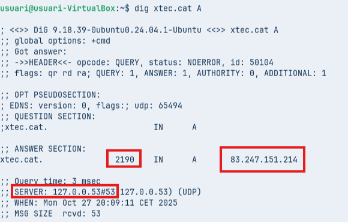
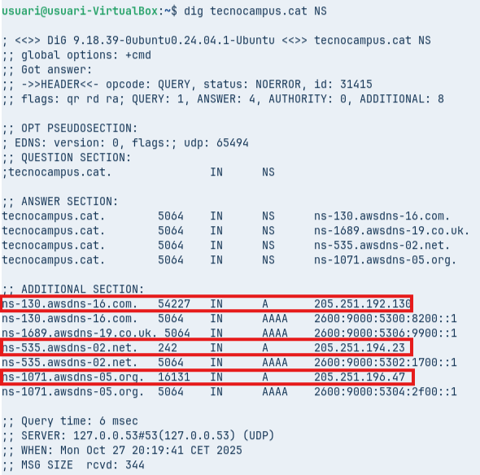
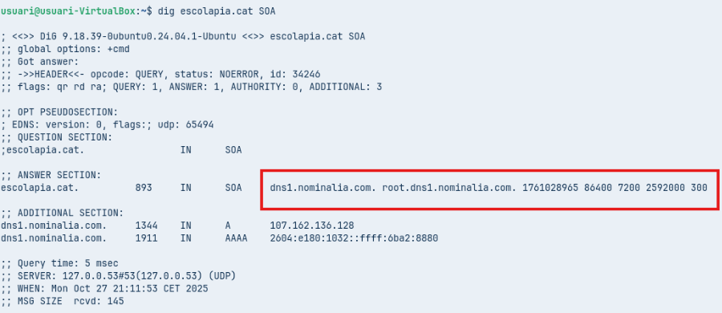
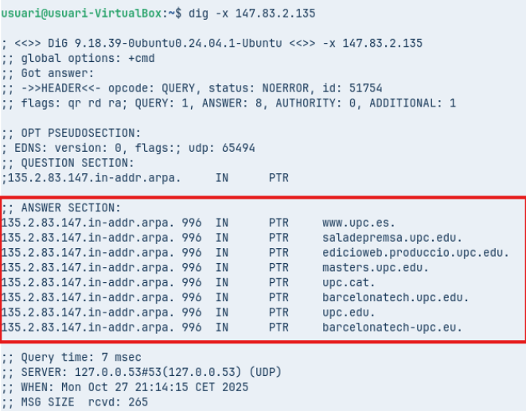
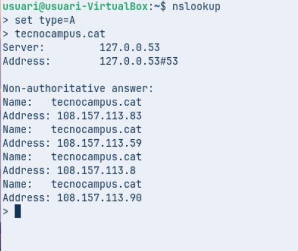
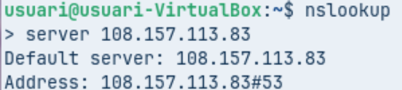
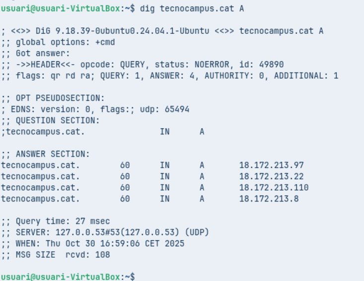

**Fase Pràctica: Diagnosi de Noms (Auditoria amb CLI)**

* **Comanda 1: Consulta Bàsica de Registre A**

- Executa dig xtec.cat A

- Anàlisi: Identifica la IP de resposta, el valor TTL i el servidor que ha respost a la consulta.

 **IP DE RESPOSTA:** 83.247.151.214

**TTL : 2190**

**SERVER:** 127.0.0.53\#53

* **Comanda 2: Consulta de Servidors de Noms (NS**

- Executa dig tecnocampus.cat NS

- Anàlisi: Quins són els servidors de noms autoritatius per a aquest domini?

* **Comanda 3: Consulta Detallada SOA**

    

- Executa dig escolapia.cat SOA

- Anàlisi: Quina és la informació del correu de l'administrador i el número de sèrie del domini?

* **Comanda 4: Consulta resolució inversa**

- Executa comanda dig \-x 147.83.2.135  
    
- Anàlisi: Quina informació sobre els registres s’obté?

**Comprovació de Resolució amb nslookup (Multiplataforma)**

* **Comanda 1: Consulta Bàsica no Autoritativa**  
    
- Seleccionar *type=A* i com a domini de consulta tecnocampus.cat  
    
- Anàlisi: Per què indica que la resposta és no autoritativa?

La resposta és no autoritativa perquè ve d’un servidor DNS i no del servidor autoritatiu del domini.

* **Comanda 2: Consultes autoritatives**  
    
- Escriure *server IP* i escriure la IP del primer servidor de noms del domini tecnocampus.cat que s’ha obtingut d’una consulta anterior. A continuació, indiqueu que voleu consultar registres de tipus A i del domini tecnocampus.cat  
    
- Anàlisi: Quines diferències s’observen a la resposta obtinguda amb la comanda 1?

