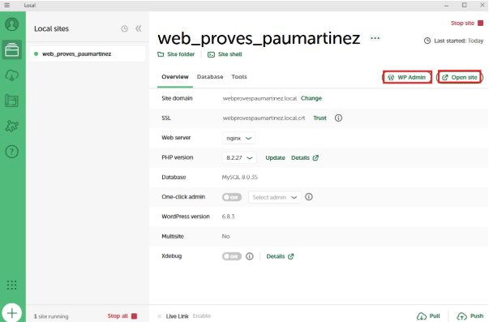
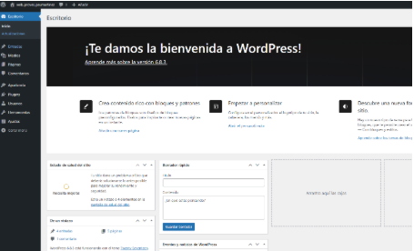
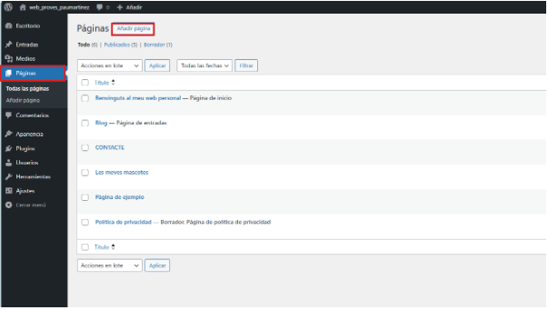
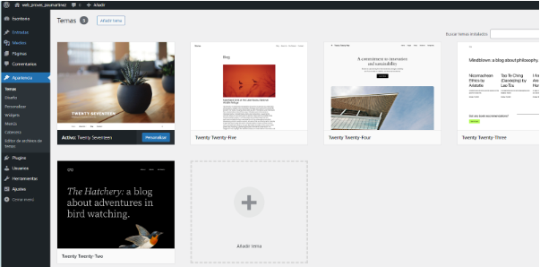
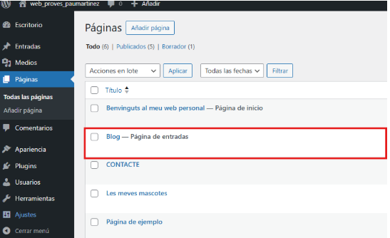
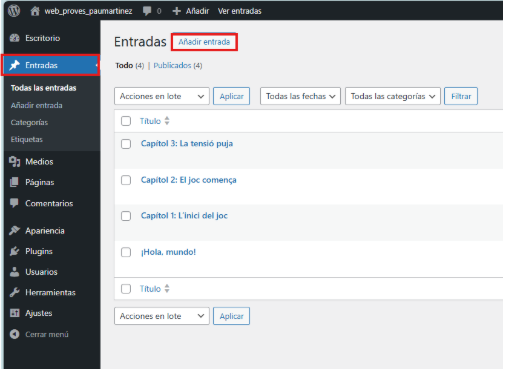
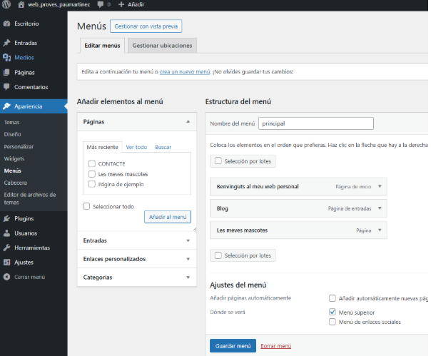
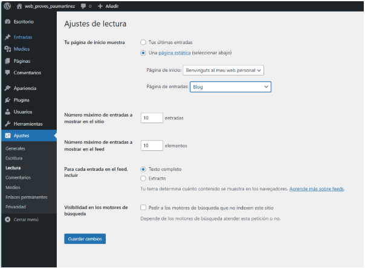
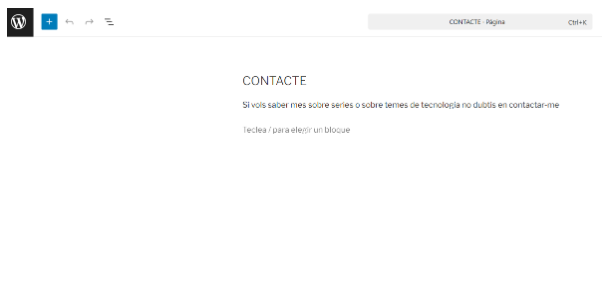

# **T11: Instal·lació de WordPress en local amb WP Local – Aplicacions Web**

Un cop instal·lat un lloc local, inicial i utilitza les dos opcions marcades en vermell per modificar el lloc web.

Després de iniciar sessió a la pagina web, entraras al inici del WorldPress,

Per crear una pagina, entra al apartat de pàgines i afegir una pàgina que es digui “Benvinguts al meu web personal”

Abans de continuar amb les opcions principals, canvia la apariencia al apartat de “Apariencia \- Temas” i selecciona la de “Twenty Seventeen”

Crear una pagina que es digui Blog pero que no tingui ningun contingut perque sera on aniran les tres entrades.

Per crear entradas ves a l'apartat de entradas i crea 3 entradas, una per cada capítol de la teva sèrie preferida.

Per canviar l’ordre de les pàgines, has de anar al apartat de “Apariencia \- Temas” i selecciona el ordre en el que vols que surtin en la página web.

Per configurar la Lectura de la pagina web, ves al apartat de “Ajustes \- Lectura” i modifica al teu gust.

Per últim crea una altre pàgina que es digui “Contacte” resumen en una frase si la gent vol contactar amb tu sobre algun tipo de temes de la informàtica.

Torna a [l'enunciat](README.md)

Torna a la pàgina [principal](../README.md)

